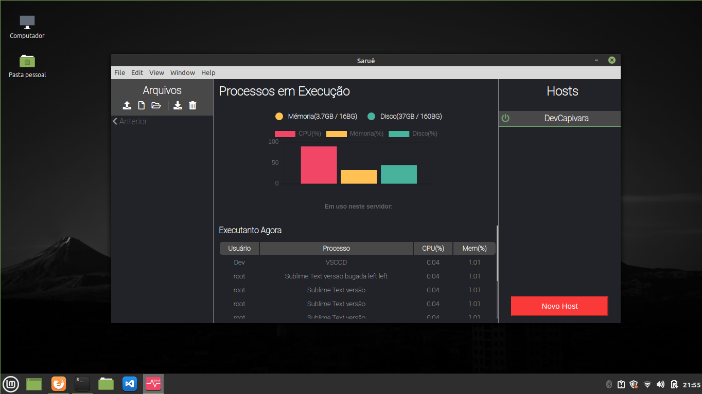

# SARUÊ MONITOR

## Descrição
A ideia do projeto é criar um cliente ssh de interface gráfica que rode em ambientes desktop(linux, mac e windows) para isso estou utilizando o framework [ELECTRON](https://www.electronjs.org/).

## Interface
A ideia da interface é ser o mais simples e objetiva possível, deixando sempre vísivel as funcionalidades principais. Até o momento a interface foi desenvolvida de seguinte maneira:

